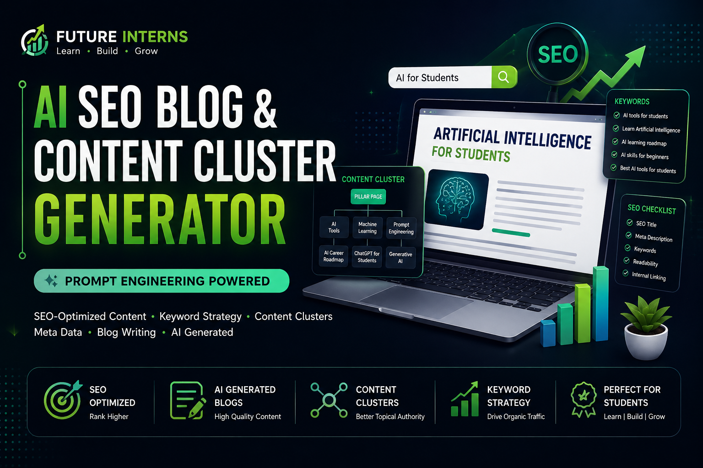

# FUTURE_PE_03

# Prompt Engineering Internship

## Task 3

AI SEO Blog & Content Cluster Generator

## Project Overview

This project demonstrates Prompt Engineering techniques for creating SEO-optimized content, including keyword research, blog writing, metadata, and content clustering.

## AI Tool

- ChatGPT

## Skills Demonstrated

- Prompt Engineering
- SEO Optimization
- AI Content Generation
- Technical Writing
- GitHub Documentation
